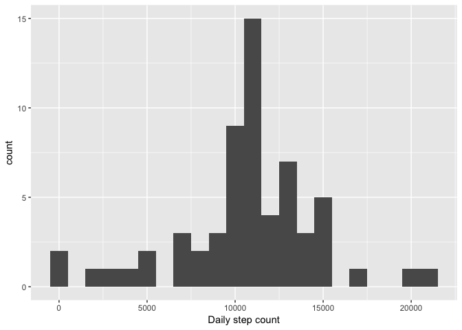

# Reproducible Research: Peer Assessment 1
## Initialization
Start by setting up the parameters for external figures.

```r
library(knitr)
opts_chunk$set(dev="png", fig.path="figure/")
```
## Loading and preprocessing the data
Unzip and load the data from a .csv file.


```r
unzip("activity.zip")
activity.data <- read.csv("activity.csv")
```

Check a short summary of what have been read.

```r
str(activity.data)
```

```
## 'data.frame':	17568 obs. of  3 variables:
##  $ steps   : int  NA NA NA NA NA NA NA NA NA NA ...
##  $ date    : Factor w/ 61 levels "2012-10-01","2012-10-02",..: 1 1 1 1 1 1 1 1 1 1 ...
##  $ interval: int  0 5 10 15 20 25 30 35 40 45 ...
```


The date column will be transformed to Date object so that it can be treated correctly in plots.

```r
activity.data$date <- as.Date(activity.data$date, format = "%Y-%m-%d")
```


## What is mean total number of steps taken per day?
Use *tapply* to calculate the number of steps taken each day.

```r
activity.data.dailysums <- tapply(activity.data$steps, activity.data$date, sum, na.rm = TRUE)
head(activity.data.dailysums)
```

```
## 2012-10-01 2012-10-02 2012-10-03 2012-10-04 2012-10-05 2012-10-06 
##          0        126      11352      12116      13294      15420
```

Plot a histogram with ggplot2 showing the distribution of daily step count.

```r
library(ggplot2)
qplot(activity.data.dailysums, binwidth=1000, xlab="Daily step count")
```

<!-- -->


Calculate the mean and median using the *summary* function.

```r
summary(activity.data.dailysums)
```

```
##    Min. 1st Qu.  Median    Mean 3rd Qu.    Max. 
##       0    6778   10400    9354   12810   21190
```


## What is the average daily activity pattern?

Use *ddply* function of the *plyr* library to calculate the mean and median values of each interval across all days: split by interval, apply mean & median, and combine to a data frame.


```r
library(plyr)
activity.data.daily.activity <- ddply(activity.data, c("interval"), summarize,
                                      mean = round(mean(steps, na.rm=TRUE), 2),
                                      median = round(median(steps, na.rm=TRUE), 2))
```

Plot the daily activity pattern.


```r
ggplot(activity.data.daily.activity, aes(x = activity.data.daily.activity$interval,
                                         y = activity.data.daily.activity$mean)) +
        geom_line() + labs(title="Mean number of daily steps", x = "Interval", y = "Mean step count")
```

<!-- -->

Calculate the maximum activity interval.


```r
activity.data.daily.activity[which.max(activity.data.daily.activity$mean), "interval"]
```

```
## [1] 835
```


## Imputing missing values
Calculate the total number of missing values with *complete.cases* function that returns a binary vector of all the rows that have none NA's. Substract the length of that vector from the number of rows in the original data.


```r
nrow(activity.data) - sum(complete.cases(activity.data))
```

```
## [1] 2304
```

Fill the missing values with the mean step count of that interval.

```r
activity.data.complete <- ddply(activity.data, c("interval"), function(x) {
        missing <- is.na(x$steps)
        x[missing, "steps"] = mean(x[, "steps"], na.rm=TRUE)
        x
})
```

Now calculate the daily step count with the data set that has missing values imputed.


```r
activity.data.complete.dailysums <- tapply(activity.data.complete$steps, activity.data.complete$date, sum, na.rm = TRUE)
head(activity.data.complete.dailysums)
```

```
## 2012-10-01 2012-10-02 2012-10-03 2012-10-04 2012-10-05 2012-10-06 
##   10766.19     126.00   11352.00   12116.00   13294.00   15420.00
```
Plot a histogram of the data.

```r
qplot(activity.data.complete.dailysums, binwidth=1000, xlab="Daily step count")
```

<!-- -->
The mean and median step counts can be viewed with the *summary* function.

```r
summary(activity.data.complete.dailysums)
```

```
##    Min. 1st Qu.  Median    Mean 3rd Qu.    Max. 
##      41    9819   10770   10770   12810   21190
```
The mean value has seen an increase compared to the original data with NA's omitted. Also, from the histogram it can be seen that the 0-bin decrased a lot. It is because in the original data, the NA's were treated as zeroes, while in the imputed data the NA's were approximated with the mean value of that interval. The mean values were affected with NA's being treated as zero, while the median was not.


## Are there differences in activity patterns between weekdays and weekends?
Construct a new column (*part.of.the.week*) based on lookup-table. The date format can be transformed to literal weekday with the *weekdays* function. The literal weekday will be used as an index pointer to the lookup-table.

```r
part.of.the.week.lookup <- cbind(
        c("Monday", "Tuesday", "Wednesday", "Thursday", "Friday", "Saturday", "Sunday"),
        c("Weekday","Weekday","Weekday","Weekday","Weekday","Weekend","Weekend"))

activity.data.complete$part.of.the.week <- part.of.the.week.lookup[
        match(weekdays(activity.data.complete$date), part.of.the.week.lookup[,1])
        , 2]    
```
Now calculate the mean step count of each interval across all days with the complete data set.

```r
activity.data.complete.mean.intervals <- ddply(activity.data.complete, c( "interval", "part.of.the.week"),
                                               summarize,
                                               meansteps = mean(steps, na.rm = TRUE)
)
```
Using ggplot's facets function, it is now easy to separate the data with *part.of.the.week* variable.

```r
ggplot(activity.data.complete.mean.intervals) + 
        geom_line(aes(y = meansteps, x = interval), stat="identity") +
        labs(title="Mean step count across intervals, weekdays vs. weekend", 
             x = "Interval", 
             y = "Mean step count") +
        facet_grid(facets = part.of.the.week ~ ., scales="free")
```

<!-- -->
